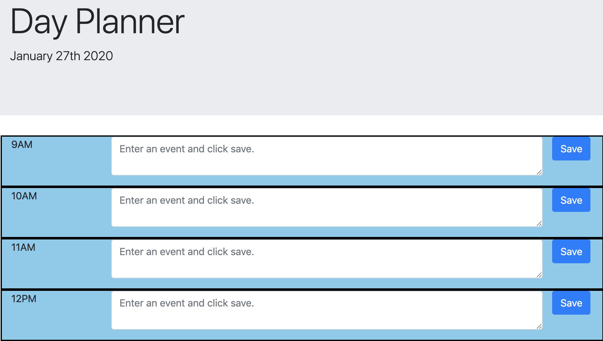

# Daily Planner
This app allows users to save events for the work day.

## More Info
The user can enter text in each hour block from 9AM to 5PM which is saved to local storage when the user clicks save.  The color of the hour block changes based on the current time.  For times that have already passed the blocks are gray.  The block that encompasses the current time will be green, and all future time blocks are blue.

## Example
